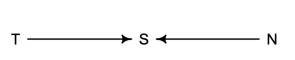

```{r setup, include=FALSE}
knitr::opts_chunk$set(echo = TRUE)
library(rethinking)
library(tidyverse)

```

# Chapter 3

This is how to generate samples from a grid posterior

```{r}
water = 6
tosses = 9
p_grid = seq(from = 0, to = 1, length.out = 1000)
prob_p = rep(1, 1000)

prob_data = dbinom(water, tosses, prob = p_grid)
posterior = prob_data * prob_p
posterior = posterior / sum(posterior)
```

Now we'll sample 10,000 times from the posterior

```{r}
samples = sample(p_grid, prob = posterior, size = 1e4, replace = T)
```

```{r}
dens(samples)
```

## Intervals of defined boundaries
What's the posterior probability that the true proportion of water is less than 50%? 

With our grid approximation we can simply sum up all the probability where that's true

```{r}
sum(posterior[p_grid < 0.5])

sum(samples < 0.5) / 1e4

```

Using the same approach you can ask how much posterior probability lies between 0.5 and 0.75?

```{r}
sum( samples > 0.5 & samples < 0.75) / 1e4
```

To define the boundaries of the lower 80% posterior probabilities we can use 
quantile funciton 
```{r}
quantile( samples, 0.8)
quantile( samples , c( 0.1 , 0.9 ) )
```

But that only works when the tails of our posterior aren't skewed, what about data like this which is? 

```{r}
p_grid <- seq( from=0 , to=1 , length.out=1000 )
prior <- rep(1,1000)
likelihood <- dbinom( 6 , size=9 , prob=p_grid )
posterior <- likelihood * prior
posterior <- posterior / sum(posterior)
samples <- sample( p_grid , size=1e4 , replace=TRUE , prob=posterior )
post = tibble(posterior = samples)
x.dens <- density(post$posterior)
df.dens <- data.frame(x = x.dens$x, y = x.dens$y)
pct_interval = PI( samples , prob=0.5 )
ggplot(data = post) + theme_bw() + 
    geom_density(aes(x=posterior, y = ..density..), color = 'black') +
    geom_area(data = subset(df.dens, x >= pct_interval[1] & x <= pct_interval[2]), 
              aes(x=x,y=y), fill = 'blue') +
    geom_vline(xintercept = pct_interval[1])  + 
    geom_vline(xintercept = pct_interval[2])  +
    ggtitle('50% Percentile Interval')
```

On the other hand we can plot the highest posterior density interval. 
The HPDI is the narrowest inteval containing the specfied probability mass. 

There is afteral an infinite number of intervals containing the same mass,
but we want the interval that best represents teh parameter values that is most
consistent with the data. 

```{r}
pct_interval = HPDI( samples , prob=0.5 )
ggplot(data = post) + theme_bw() + 
    geom_density(aes(x=posterior, y = ..density..), color = 'black') +
    geom_area(data = subset(df.dens, x >= pct_interval[1] & x <= pct_interval[2]), 
              aes(x=x,y=y), fill = 'blue') +
    geom_vline(xintercept = pct_interval[1])  + 
    geom_vline(xintercept = pct_interval[2])  +
    ggtitle('50% Highest Posterior Density Interval')
```

Now let us try to compute some point estimates. 
A common one to report is the mode of the  aposterior estimate
It's easy to calculate
```{r}
p_grid[which.max(posterior)]
```

Or from samples from the posterior
```{r}
rethinking::chainmode(samples, adj = 0.01)
```

But we could just as well use the mean or the median

A principled way to choice which point estimate is using a loss function. 
Different loss functions will imply different point estimates

Let's say we decide to make a loss function where the further away from the correct value
we are, the worse
The point estimate that maximizes that is the median of the posterior distribution

```{r}
decision = seq(from = 0 , to = 1, by = 0.001)

loss = purrr::map(decision,  ~ sum(posterior * abs(.x - p_grid))) %>% purrr::simplify()
plot(decision,loss)

p_grid[which.min(loss)]
median(samples)
```
In order to pick a point estimate, we need to define our loss function first. 

## 3.3. Sampling to simulate prediction

1. We can use sampling to design and understand what kinds of values our model is generating. 
2. We can use sampling to check that our model is working correctly
3. We can use sampling to ensure that our software fitting working properly 
4. This can help use design future experiments
5. Predictions about the future

### Dummy data and the posterior predictive distribution


```{r}
w <- rbinom( 1e4 , size=9 , prob=samples )
simplehist(w)
```


# Chapter 3 Questions
```{r generate_data}

p_grid <- seq( from=0 , to=1 , length.out=1000 )
prior <- rep( 1 , 1000 )
likelihood <- dbinom( x = 6 , size=9 , prob=p_grid )
question_post <- likelihood * prior
question_post <- question_post / sum(question_post)
set.seed(100)
question_samples <- sample( p_grid , prob=question_post , size=1e4 , replace=TRUE )

question_post = tibble(posterior_samples = question_samples)
x.dens <- density(question_post$posterior_samples)
df.dens <- data.frame(x = x.dens$x, y = x.dens$y)
```

## 3 - E1
How much posterior probability lies below p = 0.2?
```{r}


# new code is below
cutoff = 0.2

post_below = sum(question_samples < cutoff) / 1e4

ggplot(data = question_post) + theme_bw() + 
    geom_density(aes(x=posterior_samples, y = ..density..), color = 'black') + 
    geom_area(data = subset(df.dens, x <= cutoff), 
              aes(x=x,y=y), fill = 'blue') +
    geom_vline(xintercept = cutoff) +
    ggtitle(glue::glue("{post_below} is below {cutoff}")) 
    
```

## 3 - E2
How much posterior probability lies above p = 0.8?
```{r}


# new code is below
cutoff = 0.8
post_below = sum(question_samples > cutoff) / 1e4


ggplot(data = question_post) + theme_bw() + 
    geom_density(aes(x=posterior_samples, y = ..density..), color = 'black') + 
    geom_area(data = subset(df.dens, x >= cutoff), 
              aes(x=x,y=y), fill = 'blue') +
    geom_vline(xintercept = cutoff) +
    ggtitle(glue::glue("{post_below} is above {cutoff}")) 
```

## 3 - E3
How much posterior probability lies between p = 0.2 and p = 0.8?
```{r}

# new code is below
cutoff_up = 0.8
cutoff_down = 0.2
post_below = (sum(question_samples <cutoff_up & question_samples > cutoff_down))/ 1e4


ggplot(data = question_post) + 
    theme_bw() + 
    geom_density(aes(x=posterior_samples, y = ..density..), color = 'black') + 
    geom_area(data = subset(df.dens, x <= cutoff_up & x >= cutoff_down), 
              aes(x=x,y=y), fill = 'blue') +
    geom_vline(xintercept = cutoff_up) +
    geom_vline(xintercept = cutoff_down) +
    ggtitle(glue::glue("{post_below} is between {cutoff_up} & {cutoff_down}"))
```

## 3 - E4
20% of the posterior probability lies below which value of p?

```{r}

pct_interval =PI( question_samples , prob=0.60)
ggplot(data = question_post) + theme_bw() + 
    geom_density(aes(x=posterior_samples, y = ..density..), color = 'black') +
    geom_area(data = subset(df.dens, x <= pct_interval[1]), 
              aes(x=x,y=y), fill = 'blue') +
    geom_vline(xintercept = pct_interval[1])  + 
    ggtitle(glue::glue("20% of posterior probability is below {round(pct_interval[1],2)}"))

```

## 3 - E5

20% of the posterior probability lies above which value of p?


```{r}


pct_interval =PI( question_samples , prob=0.60)

ggplot(data = question_post) + theme_bw() + 
    geom_density(aes(x=posterior_samples, y = ..density..), color = 'black') +
    geom_area(data = subset(df.dens, x >= pct_interval[2]), 
              aes(x=x,y=y), fill = 'blue') +
    geom_vline(xintercept = pct_interval[2])  + 
    ggtitle(glue::glue("20% of posterior probability is above {round(pct_interval[2],2)}"))
```

## 3 - E6
Which values of p contain the narrowest interval equal to 66% of the posterior probability?
```{r}

pct_interval = HPDI( question_samples , prob=0.66)

cutoff_up = pct_interval[2]
cutoff_down = pct_interval[1]

ggplot(data = question_post) + theme_bw() + 
    geom_density(aes(x=posterior_samples, y = ..density..), color = 'black') +
    geom_area(data = subset(df.dens, x <= cutoff_up & x >= cutoff_down), 
              aes(x=x,y=y), fill = 'blue') +
    geom_vline(xintercept = cutoff_up) +
    geom_vline(xintercept = cutoff_down) +
    ggtitle(glue::glue("The narrowest interval equal to 66% of the posterior probability \n is between {round(cutoff_down,2)} & {round(cutoff_up,2)}"))
```

## 3 - E7

Which values of p contain 66% of the posterior probability, assuming equal posterior probability both below and above the interval?

```{r}

pct_interval = PI( question_samples , prob=0.66)

cutoff_up = pct_interval[2]
cutoff_down = pct_interval[1]
ggplot(data = question_post) + theme_bw() + 
    geom_density(aes(x=posterior_samples, y = ..density..), color = 'black') +
    geom_area(data = subset(df.dens, x <= cutoff_up & x >= cutoff_down), 
              aes(x=x,y=y), fill = 'blue') +
    geom_vline(xintercept = cutoff_up) +
    geom_vline(xintercept = cutoff_down) +
    ggtitle(glue::glue("Assuming equal mass on left and right tail -  \n  66% of posterior probability is between {round(cutoff_down,2)} & {round(cutoff_up,2)}"))
```

## 3 - M1
Suppose the globe tossing data had turned out to be 8 water in 15 tosses. Construct the posterior distribution, using grid approximation. Use the same flat prior as before.

```{r generate_data_new,echo = TRUE}

p_grid <- seq( from=0 , to=1 , length.out=1000 )
prior <- rep( 1 , 1000 )
likelihood <- dbinom( x = 8 , size=15 , prob=p_grid )
question_post_medium <- likelihood * prior
question_post_medium <- question_post_medium / sum(question_post_medium)
```

## 3 - M2
Draw 10,000 samples from the grid approximation from above. Then use the samples to calculate the 90% HPDI for p.

```{r,echo = TRUE}
set.seed(100)

question_samples_medium <- sample( p_grid , prob=question_post_medium , size=1e5 , replace=TRUE )

question_post_medium = tibble(posterior_samples = question_samples_medium)

x.dens <- density(question_post_medium$posterior_samples)
df.dens <- data.frame(x = x.dens$x, y = x.dens$y)


pct_interval = HPDI( question_samples_medium , prob=0.90)
cutoff_up = pct_interval[2]
cutoff_down = pct_interval[1]
flat_prior_plot = ggplot(data = question_post_medium) + theme_bw() + 
    geom_density(aes(x=posterior_samples, y = ..density..), color = 'black') +
    geom_area(data = subset(df.dens, x <= cutoff_up & x >= cutoff_down), 
              aes(x=x,y=y), fill = 'blue') +
    geom_vline(xintercept = cutoff_up) +
    geom_vline(xintercept = cutoff_down) +
    ggtitle(glue::glue("For 8 water in 15 tosses the \n narrowest interval equal to 90% of the posterior probability \n is between {round(cutoff_down,2)} & {round(cutoff_up,2)}"))
print(flat_prior_plot)
```

## 3 - M3
Construct a posterior predictive check for this model and data. This means simulate the distribution of samples, averaging over the posterior uncertainty in p. What is the probability of observing 8 water in 15 tosses?
```{r, echo= T}
#simulate the distribution of samples
posterior_predictive <- rbinom( 1e4 , size=15 , prob=question_post_medium$posterior_samples )
simplehist(posterior_predictive)
sum(posterior_predictive == 8) / length(posterior_predictive)
```

The probability of observing 8 water in 15 tosses is `r sum(posterior_predictive == 8) / length(posterior_predictive)`

## 3 - M4

using the posterior from 8/15 calculate the probability of 6 water in 9 tosses
```{r}
#simulate the distribution of samples
posterior_predictive_69 <- rbinom( 1e4 , size=9 , prob=question_post_medium$posterior_samples )
simplehist(posterior_predictive_69)
sum(posterior_predictive_69 == 6) / length(posterior_predictive_69)
```
The probability of 6 water in 9 tosses is `r sum(posterior_predictive_69 == 6) / length(posterior_predictive_69)`

## 3 - M5
Start over at M1 but now start with either prior that p > 0.5 and anything below 
is 0 - basically start knowing that the majority of the Earth is water.
```{r majority_water,echo = TRUE}
p_grid <- seq( from=0 , to=1 , length.out=1000 )
prior_majority_water <- rep( 1 , 1000 )
prior_majority_water[which(p_grid < 0.5)] = 0
likelihood_majority_water <- dbinom( x = 8 , size=15 , prob=p_grid )
posterior_majority_water <- likelihood_majority_water * prior_majority_water
posterior_majority_water <- posterior_majority_water / sum(posterior_majority_water)
```

Comparing the 90% HPDI for the uniform prior and the one where we know 
majority of the Earth is water
```{r}
set.seed(100)

question_samples_maj_water <- sample( p_grid , prob=posterior_majority_water , size=1e5 , replace=TRUE )

question_post_maj_water = tibble(posterior_samples = question_samples_maj_water)

x.dens <- density(question_post_maj_water$posterior_samples)
df.dens <- data.frame(x = x.dens$x, y = x.dens$y)


pct_interval = HPDI( question_samples_maj_water , prob=0.90)
cutoff_up = pct_interval[2]
cutoff_down = pct_interval[1]

maj_water_plot = ggplot(data = question_post_maj_water) + theme_bw() + 
    geom_density(aes(x=posterior_samples, y = ..density..), color = 'black') +
    geom_area(data = subset(df.dens, x <= cutoff_up & x >= cutoff_down), 
              aes(x=x,y=y), fill = 'blue') +
    geom_vline(xintercept = cutoff_up) +
    geom_vline(xintercept = cutoff_down) +
    ggtitle(glue::glue("Majority water - For 8 water in 15 tosses the \n 90% of the posterior probability \n is between {round(cutoff_down,2)} & {round(cutoff_up,2)}")) + xlim(0,1)

ggpubr::ggarrange(flat_prior_plot,maj_water_plot)
```

## 3 - M5 - Posterior predictive check 
Construct a posterior predictive check for this model and data. This means simulate the distribution of samples, averaging over the posterior uncertainty in p. What is the probability of observing 8 water in 15 tosses?
```{r}
#simulate the distribution of samples
posterior_predictive_maj <- rbinom( 1e4 , size=15 , prob=question_post_maj_water$posterior_samples )
simplehist(posterior_predictive_maj)
sum(posterior_predictive_maj == 8) / length(posterior_predictive_maj)
```

Flat prior of observing 8 water in 15 tosses is `r sum(posterior_predictive == 8) / length(posterior_predictive)`

Knowing the Earth is mostly water observing 8 water in 15 tosses is `r sum(posterior_predictive_maj == 8) / length(posterior_predictive_maj)`

## 3 - M5 - Calculate 6 in 9 from the sample

using the posterior from 8/15 calculate the probability of 6 water in 9 tosses
```{r}
#simulate the distribution of samples
posterior_predictive_69_maj <- rbinom( 1e4 , size=9 , prob=question_post_maj_water$posterior_samples )
simplehist(posterior_predictive_69)
simplehist(posterior_predictive_69_maj)
sum(posterior_predictive_69_maj == 6) / length(posterior_predictive_69)
```

Flat prior -  probability of 6 water in 9 tosses is `r sum(posterior_predictive_69 == 6) / length(posterior_predictive_69)`

Majority water prior -  probability of 6 water in 9 tosses is `r sum(posterior_predictive_69_maj == 6) / length(posterior_predictive_69)`

## 3 - M6

Suppose you want to estimate the Earth’s proportion of water very precisely. Specifically, you want the 99% percentile interval of the posterior distribution of p to be only 0.05 wide. This means the distance between the upper and lower bound of the interval should be 0.05. How many times will you have to toss the globe to do this?

```{r, echo = TRUE}


generate_intervals_by_num = function(num_samples = 10,uniform = TRUE){
    set.seed(42)
    p_grid <- seq( from=0 , to=1 , length.out=1000 )
    if(uniform == TRUE){
       prior <- rep( 1 , 1000 )

    }else{
      prior = ifelse(p_grid < 0.5 , 0 , 1)

    }

    
    tosses = rbinom(1,size = num_samples, prob = 0.7)
    
    likelihood <- dbinom( x = tosses , size=num_samples , prob=p_grid )

    looping_posterior <- likelihood * prior
    looping_posterior <- looping_posterior / sum(looping_posterior)
    
    sampled_loop <- sample( p_grid , prob=looping_posterior , size=1e5 , replace=TRUE )
    
    pct = HPDI(sampled_loop,prob = 0.99)

    width = abs(pct[2] - pct[1])

    return(width)
}


num_sample = 1500
width_of_hpdi = generate_intervals_by_num(num_sample)
while(width_of_hpdi > 0.05){
    num_sample = num_sample + 1
    width_of_hpdi = generate_intervals_by_num(num_sample)
}
beepr::beep(sound = 2)

num_sample_maj = 500
width_of_hpdi_maj_water = generate_intervals_by_num(num_sample_maj,uniform = FALSE)
while(width_of_hpdi_maj_water > 0.05){
    num_sample_maj = num_sample_maj + 1
    width_of_hpdi_maj_water = generate_intervals_by_num(num_sample_maj,uniform = FALSE)
}
print(num_sample)

```


## 3 - H1

Introduction. The practice problems here all use the data below. These data indicate the gender
(male=1, female=0) of officially reported first and second born children in 100 two-child families.


```{r}
birth1 <- c(1,0,0,0,1,1,0,1,0,1,0,0,1,1,0,1,1,0,0,0,1,0,0,0,1,0,
0,0,0,1,1,1,0,1,0,1,1,1,0,1,0,1,1,0,1,0,0,1,1,0,1,0,0,0,0,0,0,0,
1,1,0,1,0,0,1,0,0,0,1,0,0,1,1,1,1,0,1,0,1,1,1,1,1,0,0,1,0,1,1,0,
1,0,1,1,1,0,1,1,1,1)
birth2 <- c(0,1,0,1,0,1,1,1,0,0,1,1,1,1,1,0,0,1,1,1,0,0,1,1,1,0,
1,1,1,0,1,1,1,0,1,0,0,1,1,1,1,0,0,1,0,1,1,1,1,1,1,1,1,1,1,1,1,1,
1,1,1,0,1,1,0,1,1,0,1,1,1,0,0,0,0,0,0,1,0,0,0,1,1,0,0,1,0,0,1,1,
0,0,0,1,1,1,0,0,0,0)


birth_tibble = data.table::data.table(birth1,birth2)
```


Using grid approximation, compute the posterior distribution for the probability of a birth being a boy. Assume a uniform prior probability. Which parameter value maximizes the posterior probability?

```{r, echo = TRUE}

p_grid <- seq( from=0 , to=1 , length.out=1000 )
prior <- rep( 1 , 1000 )
likelihood_boy <- dbinom( x = 111 , size=200 , prob=p_grid )
hard_posterior <- likelihood_boy * prior
hard_posterior <- hard_posterior / sum(hard_posterior)
```


```{r}
hard_posterior_samples <- sample( p_grid , prob=hard_posterior , size=1e5 , replace=TRUE )

hard_posterior_samples = tibble(posterior_samples = hard_posterior_samples)

x.dens <- density(hard_posterior_samples$posterior_samples)
df.dens <- data.frame(x = x.dens$x, y = x.dens$y)

point = tibble(x = p_grid[which.max(hard_posterior)], y = max(density(hard_posterior_samples$posterior_samples)$y))

ggplot(data = hard_posterior_samples) + theme_bw() + 
    geom_density(aes(x=posterior_samples, y = ..density..), color = 'black') +
    geom_point(data = point, aes(x = x, y = y),size = 4) + 
    xlim(0,1) + 
    ggtitle(glue::glue("The maximum a posteriori estimate for being born a boy is {round(p_grid[which.max(hard_posterior)],2)}"))
```


## 3 - H2

Using the sample function, draw 10,000 random parameter values from the posterior distri- bution you calculated above. Use these samples to estimate the 50%, 89%, and 97% highest posterior density intervals.

```{r}

create_hpdi_plot = function(prob,posterior_samples_df){
    x.dens <- density(posterior_samples_df$posterior_samples)
    df.dens <- data.frame(x = x.dens$x, y = x.dens$y)
    
    pct_interval = HPDI(posterior_samples_df$posterior_samples , prob=prob)

    cutoff_up = pct_interval[2]
    cutoff_down = pct_interval[1]
    
    hpdi_graph = ggplot(data = posterior_samples_df) + theme_bw() + 
        geom_density(aes(x=posterior_samples, y = ..density..), color = 'black') +
        geom_area(data = subset(df.dens, x <= cutoff_up & x >= cutoff_down), 
                  aes(x=x,y=y), fill = 'blue') +
        geom_vline(xintercept = cutoff_up) +
        geom_vline(xintercept = cutoff_down) +
        xlim(0,1) + 
        ggtitle(glue::glue("Highest {prob * 100}% of the posterior probability \n is between {round(cutoff_down,2)} & {round(cutoff_up,2)}"))
    
    return(hpdi_graph)
}

plts = purrr::map(c(0.5,0.89,0.97),create_hpdi_plot,hard_posterior_samples)
ggpubr::ggarrange(plotlist =  plts,nrow = 3)
```

## 3 - H3

Use rbinom to simulate 10,000 replicates of 200 births. 
Compare the distribution of predicted numbers to actual count. 
Does it look like the model fits the data well - does the distribution of predictions
include the actual observation as a central, likely outcome? 

```{r}
simulated_births <- rbinom( 1e4 , size=200,prob = 0.5)
ggplot() + 
    geom_density(aes(x = simulated_births)) + 
    geom_vline(xintercept =  111) + 
    ggtitle("Simulated Births - Line at true boy births 111")
```

## 3 - H4

Now compare only to the counts of first borns 
```{r}
simulated_births <- rbinom( 1e4 , size=100,prob = 0.5)
ggplot() + 
    geom_density(aes(x = simulated_births)) + 
    geom_vline(xintercept =  51) + 
    ggtitle("Simulated Births - First Born Sex - 51 boys")
```

## 3 - H5

The model assumes independence between birth order and baby sex. 
But is this true? Focus on the sex of the second born after a girl. 
```{r}
simulated_births <- rbinom( 1e4 , size=49,prob = 0.5)
ggplot() + 
    geom_density(aes(x = simulated_births)) + 
    geom_vline(xintercept =  39) + 
    ggtitle(glue::glue("Simulated Births - Older Sibling Female :( "))
```

We could do a chi.sq as well showing the lack of independence here?

# Chapter 4

Linear regression is a descriptive model which can make helpful predictions for us, but if we try to read into it's structure as meaning something, we're likely to make mistakes. 

There's nothing magical about the normal distribution - let's take a coin flip example, where me and all 999 of my friends each take a coin and line up on the 
center line of a field, for each heads we take one step to the right and for tails a step to the left, and we do that 16 times. 
We will arrange ourselves into a normal distribution at the end of the 16 trials. 

This is normal by addition. 

```{r}
pos = replicate(1000, sum(runif(16, -1, 1)))
```


Any process which adds together random values from the same distribution will converge to normal. 

Small effects multiplied tend to be equivalent to adding them. 

Adding logs is equivalent to multiplying the original numbers - thus even large 
multiplicative effects tend to be normal once we put them on the log scale. 

There are two justifications for using Gaussian distributions: 

1. ontological(related to the state of being or existence) - they're everywhere. 
They're everywhere because measurement errors and true variations are lots of 
minor fluctuations from a true generating mean which all add together and cancel out
and thus leave only the mean and spread behind 

2. epistemological (the state of knowledge) - Gaussian distribution can be realized 
in the most possible ways, therefore we make the least number of assumptions about the
generating process when we choose to start from a Gaussian. If we don't pick a Gaussian, 
that assumes we know something about the data generating process that tells us not to 
pick a Gaussian. 


The common language for describing a model. 

First we recognize a set of things we want to understand, called our variables. 

We start with data - these are things we can actually observe. 

Unobservable things like rates and averages we call the parameters. 

For the things we want to understand, we define them in terms of other variables or in terms of a probability distribution. 

## Gaussian model of height

We're going to make a linear regression between height and weight. 
We want a single measurement variable to model as a Gaussian distribution, with two parameters to describe its
shape the mean mu and the standard deviation sigma. 
We'll use Bayesian updated to allow us to consider every possible combination of values for mu and sigma, 
and to score each combination by its relative plausibility, considering the data. 

The estimate will be the entire posterior distribution, not any point within it - so they posterior distribution will be a distribution of Gaussian distributions. 

## The data to regress

We're going to use the `Howell1` census data. 

```{r}
library(rethinking)
data("Howell1")
d = Howell1
#keep only the adults - as the heights and weights of children are related differently
d2 = d %>% filter(age >= 18)
rethinking::dens(d2$height)
```

Let's start by using a Gaussian distribution, because we have no good reason not to

height_individual ~ Normal(mu, sigma)

mu ~ Normal(178, 20) - a prior assumption on the average height of an individual

sigma ~ Uniform(0, 50) - a prior assumption about the variability of height. 

Once you pick some priors, you should plot them so you know what you're assuming

```{r}
curve( dnorm( x , 178 , 20 ) , from=100 , to=250)
```

```{r}
curve( dunif( x , 0 , 50 ) , from=-10 , to=60 )
```

As we've done before we can sample from heights using these prior

```{r}
sample_mu = rnorm(1e4, 178, 20)
sample_sigma = runif(1e4, 0 , 50)
prior_h = rnorm(1e4, sample_mu, sample_sigma)
dens(prior_h)
```

Right, so first we're going to calculate the posterior distribution using grid approximation

```{r}
mu.list <- seq( from=150, to=160 , length.out=100 ) 
sigma.list <- seq( from=7 , to=9 , length.out=100 )
post <- expand.grid( mu=mu.list , sigma=sigma.list )
post$LL <- sapply( 1:nrow(post) , function(i) sum(
dnorm( d2$height , post$mu[i] , post$sigma[i] , log=TRUE ) ) )
post$prod <- post$LL + dnorm( post$mu , 178 , 20 , TRUE ) +
dunif( post$sigma , 0 , 50 , TRUE )
post$prob <- exp( post$prod - max(post$prod) )

contour_xyz( post$mu , post$sigma , post$prob )
```


We can again sample parameter values from the posterior, but now we have 2 parameters

```{r}
sample.rows <- sample( 1:nrow(post) , size=1e4 , replace=TRUE ,prob=post$prob )
sample.mu <- post$mu[ sample.rows ]
sample.sigma <- post$sigma[ sample.rows ]
plot( sample.mu , sample.sigma , cex=0.5 , pch=16 , col=col.alpha(rangi2,0.1) )

dens( sample.mu )
dens( sample.sigma )

PI( sample.mu )
PI( sample.sigma )
```

Quap quap ya'll

```{r}
flist = alist(
  height ~ dnorm(mu, sigma),
  mu ~ dnorm(178, 20 ),
  sigma ~ dunif(0, 50)
)

m4.1 = rethinking::quap(flist, d2)

precis( m4.1 )

vcov( m4.1 )

library(rethinking)
post <- extract.samples( m4.1 , n=1e4 ) #to extract samples from the quap 
head(post)
```

## Linear model

A linear model assumes that a predictor variable has a constant and additive
relationship t the mean of the outcome. 

To get our predictor variable into the definition of height

height_individual ~ Normal(mu_i, sigma) - likelihood

mu_i = a + b * (x_i - x_bar) - the linear models

a ~ Normal(178, 20) - a prior on alpha
b ~ Normal(0, 10) - a prior on beta
sigma ~ Uniform(0,50) - a prior on sigma

What do our prior generator for us?

```{r}
set.seed(2971)
N <- 100 # 100 lines
a <- rnorm( N , 178 , 20 )
b <- rnorm( N , 0 , 10 )

plot( NULL , xlim=range(d2$weight) , ylim=c(-100,400) ,
xlab="weight" , ylab="height" )
abline( h=0 , lty=2 )
abline( h=272 , lty=1 , lwd=0.5 )
mtext( "b ~ dnorm(0,10)" )
xbar <- mean(d2$weight)
for ( i in 1:N ) curve( a[i] + b[i]*(x - xbar) ,
from=min(d2$weight) , to=max(d2$weight) , add=TRUE ,
col=col.alpha("black",0.2) )
```

Well that generates some craziness - after all we know there's going to be a 
positive relationship between height and weight. So let's stop it from being negative. 
The easiest way to do that is to define a prior as Log-Normal instead.

B ~ Log-Normal(0,1)

exp(x) is greater than zero for any real number x, therefore if the log of 
B is normal, then B itself must be positive. 

```{r}
b <- rlnorm( 1e4 , 0 , 1 ) 
dens( b , xlim=c(0,5) , adj=0.1 )
```

Now let's try again, but using a log-normal to keep B positive

```{r}
set.seed(2971)
N <- 100 # 100 lines
a <- rnorm( N , 178 , 20 )
b <- rlnorm( N , 0 , 1 ) 

plot( NULL , xlim=range(d2$weight) , ylim=c(-100,400) ,
xlab="weight" , ylab="height" )
abline( h=0 , lty=2 )
abline( h=272 , lty=1 , lwd=0.5 )
mtext( "b ~ dnorm(0,10)" )
xbar <- mean(d2$weight)
for ( i in 1:N ) curve( a[i] + b[i]*(x - xbar) ,
from=min(d2$weight) , to=max(d2$weight) , add=TRUE ,
col=col.alpha("black",0.2) )
```

Now let's find the posterior distribution

```{r eval=FALSE}


# #Define average weight, x_bar
xbar <- mean(d2$weight)
# 
m4.3 <- quap(
  alist(
    height ~ dnorm(mu, sigma),
    mu <- a + b*(weight - xbar),
    a ~ dnorm(178,20),
    b ~ dlnorm(0,1),
    sigma ~ dunif(0, 50)
  ),
  data = d2
)
```

While this may be a little mathematically dodgey, for y = log(x), we can imagine this as saying that we're going to assign y to be the order of magnitude of x. And when we see the function x= exp(y) we're turning a magnitude into a value. 

So now this lets us code a log-normal prior of beta to be coded another way

```{r }
f = d2$weight
f = mean(f)
d2$xbar <- f
m4.3b <- quap(
  alist(
    height ~ dnorm( mu , sigma ) ,
    mu <- a + exp(log_b)*( weight - xbar ),
    a ~ dnorm( 178 , 20 ) ,
    log_b ~ dnorm( 0 , 1 ) ,
    sigma ~ dunif( 0 , 50 )) ,
data=d2 )
```

Ok we have a posterior, now what? 

Well, obviously we plot it

```{r}
rethinking::pairs(m4.3b)
```

```{r}
plot( height ~ weight , data=d2 , col=rangi2 )
post <- extract.samples( m4.3b )
a_map <- mean(post$a)
b_map <- mean(post$b)
curve( a_map + b_map*(x - xbar) , add=TRUE )
```


OK so let's look at tables of a trained model first about the relationship between height and weight

```{r}
precis(m4.3b)
```

So, what do these mean? Starting with beta we can read this as "a person 1kg heavier is expected to be 0.90 cm taller. 89% o the posterior probability lies between 0.84 and 0.97

Let's draw some uncertainty by sampling from the posterior
```{r}
N <- 100
dN <- d2[ 1:N , ]
mN <- quap(
alist(
height ~ dnorm( mu , sigma ) ,
mu <- a + b*( weight - mean(weight) ) ,
a ~ dnorm( 178 , 20 ) ,
b ~ dlnorm( 0 , 1 ) ,
sigma ~ dunif( 0 , 50 )
) , data=dN )
post <- extract.samples(m4.3b)

# display raw data and sample size
plot( dN$weight , dN$height ,
xlim=range(d2$weight) , ylim=range(d2$height) ,
col=rangi2 , xlab="weight" , ylab="height" )
mtext(concat("N = ",N))

post <- extract.samples( mN , n=20 )
# display raw data and sample size
plot( dN$weight , dN$height ,
xlim=range(d2$weight) , ylim=range(d2$height) ,
col=rangi2 , xlab="weight" , ylab="height" )
mtext(concat("N = ",N))
# plot the lines, with transparency
for ( i in 1:20 )
curve( post$a[i] + post$b[i]*(x-mean(dN$weight)) ,
col=col.alpha("black",0.3) , add=TRUE )
```


# Chapter 6


This chapter is about the terrible things that can happen if we just go adding
variables to a regression willy-nilly without a framework of causality first. 
We're going to explore multicollinearity, post-treatment bias, and collider bias. 

We aim to walk out with a framework that will tell us which variables we must and must not add to a model
in order to arrive at valid inferences. 

## Multicollinearity

This means a ver strong correlation between two or more predictor variables. 
If we throw a bunch of corelated predictors into the model, our posterior 
will then tell us none of the variables reliably asssocaites with outcome - even if 
they all actually due. 

Let's start with a simple simluation on an individual's hieght using the length
of their legs as predictor variables

```{r}

N <- 100
set.seed(909)
h <- rnorm(N,10,2) #sim total each of each
leg_prop = runif(N,0.4,0.5) #leg as a proportion of height
leg_left <- leg_prop*h + rnorm(N, 0, 0.02) # left leg as prop plus error
leg_right <- leg_prop*h + rnorm(N, 0, 0.02)

d <- data.frame(h, leg_left,leg_right)
```


Since we've said that an individual's legs are 45% of their height in this simulated data, we 
would expect the beta coefficient between the association of a leg with height to end up around the 
average height (10) divided by 45% of the average height (4.5), so around 2.2 

```{r}
library(rethinking)
m6.1 <- quap(
  alist(
    h ~ dnorm(mu, sigma),
    mu <- a + bl*leg_left + br*leg_right, 
    a ~ dnorm(10, 100),
    bl ~ dnorm(2, 10),
    br ~ dnorm(2, 10 ),
    sigma ~ dexp(1)
  ),
  data = d
)
precis(m6.1) 
plot(precis(m6.1))
```

This ends up weird because if we remember what multiple regression is asking:
"What is the value of knowing each predictor, after already knowing all the others?"

or "what is the value of knowing the length of the left leg, if we know the length of the right?"

Now we know that it's obviously silly to use both legs, since they give the same
info, let's try another example where it's not so obvious. 

```{r}
data(milk)
d <- milk
d <- d %>% 
  mutate(across(kcal.per.g:perc.lactose,scale,.names = "scale_{.col}"))

m6.3 <- quap(
  alist(
    scale_kcal.per.g ~ dnorm(mu, sigma),
    mu <- a + bF * scale_perc.fat,
    a ~ dnorm(0,0.2),
    bF ~ dnorm(0,0.5),
    sigma ~ dexp(1)
  ), data = d
)

m6.4 <- quap(
  alist(
    scale_kcal.per.g ~ dnorm(mu, sigma),
    mu <- a + bL * scale_perc.lactose,
    a ~ dnorm(0,0.2),
    bL ~ dnorm(0,0.5),
    sigma ~ dexp(1)
  ), data = d
)

precis( m6.3 )
precis( m6.4 )
```

When we inspect the pairsplot, we can see that while either lactose or fat 
percentage tell you the calories, they do so nearly perfectly oppositely. 
```{r}
 pairs( ~ kcal.per.g + perc.fat + perc.lactose , data=d , col=rangi2 )
```


## Post-treatment bias

Post-treatment bias is the problem that arises when you include a predictor 
variable which is a consequence of other variables. 

Let's say we wanted to know how tall some plants grew after an anti-fungal treatment. 
So we record intitial height, final height, treatment, and prescence of fungas. 

Since the prescence of the fungas is a post-treatmeant effect, we shouldn't include
both it and the treatment. 

```{r fungas}
set.seed(71)
#Number of plants
N <- 100
#simulate intital height
h0 <- rnorm(N, 10, 2)

treatment <- rep(0:1, each = N/ 2)
fungus <- rbinom(N, size = 1, prob = 0.5 - treatment*0.4)
h1 <- h0 + rnorm(N, 5 - 3*fungus)

d <- data.frame(h0,h1,treatment,fungus)
precis(d)
```


Let's set up a simple model so that 

h1_i ~ Normal(mu_i, sigma)
mu_i = h0_i * p

Where p = h1_i / h0_i, so that if p == 2 a plant has doubled in height and if we
center it on 1 that would imply no change in height.

We have to make sure that our p > 0, but we should let it be less than one 
(we could really mess up the experiment afterall)

```{r}
sim_p <- rlnorm(1e4,0,0.25)
precis(data.frame(sim_p))
```

```{r}
m6.6 <- quap(
  alist(
    h1 ~ dnorm(mu, sigma),
    mu <- h0*p,
    p <- dlnorm(0,0.25),
    sigma ~ dexp(1)
  ), data = d
)
precis(m6.6)
```

And with the p at 1.43 we get about 40% growth rate, now let's see what happens
when we include the treatment and fungus. 

h1_i ~ Normal(mu_i, sigma)
mu_i = h0_i * p

Now including the fungus and treatment

p = alpha * Beta_T * T_i + Beta_F * F_i
alpha ~ Log-Normal(0, 0.25)
Beta_T ~ Normal(0,0.5)
Beta_F ~ Normal(0,0.5)
sigma ~ Exponential(1)

```{r}
m6.7 <- quap(
  alist(
    h1 ~ dnorm(mu, sigma),
    mu <- h0*p,
    p <- a + bt*treatment + bf*fungus,
    a ~ dlnorm(0,0.2),
    bt ~ dnorm(0,0.5),
    bf ~ dnorm(0,0.5),
    sigma ~ dexp(1)
  ), data = d
)
precis(m6.7)
```

The a parameter is basically the same as p was before, and the treatment 
has an effect of essentially 0, which is weird since we built the model using 
treatment. What's going on? 

Well - it's kind of the same problem as before, because once we know whether 
or not a plant developed fungus, does soil treatment matter to our prediction?
And the answer is no, because soil treatment has it's effect through fungus. 

```{r}
m6.8 <- quap(
  alist(
    h1 ~ dnorm(mu, sigma),
    mu <- h0*p,
    p <- a + bt*treatment,
    a ~ dlnorm(0,0.2),
    bt ~ dnorm(0,0.5),
    sigma ~ dexp(1)
  ), data = d
)
precis(m6.8)
```

Now we have a positive effect of treatment. But this doesn't mean that 
the model with both was useless, the fact that including the fungus 
zero'ed the treatment effect shows us that the effect on height is acting through 
the fungus. 

```{r}
pacman::p_load(dagitty)
plant_dag <- dagitty("dag{
                     H_0 -> H_1
                     F -> H_1
                     T -> F
}")
coordinates(plant_dag) <- list(x = c(H_0 = 0, T = 2, F = 1.5, H_1=1),
                               y = c(H_0 = 0, T = 0, F = 0, H_1=0))

drawdag(plant_dag)
```

When we include F, the post-treatment effect, in the model we end up blocking
the path from the treatment to the outcome, e.g. learning the treatment tells
us nothing about the outcome, once we know the fungus status. 

A cool DAG lingo for this is "conditioning on F induces D-Separation" 

```{r}
 impliedConditionalIndependencies(plant_dag)
```

Conditioning on a post-treatment variable can also convince you that something works when it doesn't. 


Let's say that really what's affecting growth is the unobserved moisture content - M
and that that variable also affects fungus growth. 

```{r}
set.seed(71)
N <- 1000
h0 <- rnorm(N,10,2)
treatment <- rep( 0:1 , each=N/2 )
M <- rbern(N)
fungus <- rbinom( N , size=1 , prob=0.5 - treatment*0.4 + 0.4*M )
h1 <- h0 + rnorm( N , 5 + 3*M )
d2 <- data.frame( h0=h0 , h1=h1 , treatment=treatment , fungus=fungus )
```


```{r}
m6.7_moist <- quap(
  alist(
    h1 ~ dnorm(mu, sigma),
    mu <- h0*p,
    p <- a + bt*treatment + bf*fungus,
    a ~ dlnorm(0,0.2),
    bt ~ dnorm(0,0.5),
    bf ~ dnorm(0,0.5),
    sigma ~ dexp(1)
  ), data = d2
)

m6.8_moist <- quap(
  alist(
    h1 ~ dnorm(mu, sigma),
    mu <- h0*p,
    p <- a + bt*treatment,
    a ~ dlnorm(0,0.2),
    bt ~ dnorm(0,0.5),
    sigma ~ dexp(1)
  ), data = d2
)
precis(m6.7_moist)
precis(m6.8_moist)
```

Now we seem to see that treatment and fungus both have positive effects when we include 
bt and bf, and bt has an effect of essentially zero when we exclude bf. 

The reason for these effect has to do with... collider bias

## Collider bias

Let's consider the problem of publication bias, trustworthiness and newsworthiness
are statistically independent in the population, but they both affect S (funding)



The fact 2 arrows enter S means it is a collider. 
When you condition on a collider is creates a statistical, but not neccessarily causal,
associations between its causes. 

Another example:

Happiness (H) and Age (A) both cause marriage (M), therefore marriage is a collider, and even though there
is no causal association between age and happiness, if we included marraige as a predictor 
in a regression it would indcue a statisical association between age and happiness.

Let's do an agent-based model of aging and marriage:

1. each year 20 people are born with uniform distributed happiness
2. each year, each person ages one year
3. age age 18 individuals can get married, the odds of marriage each year
is proportional to marraige
4. once married and individual stays married
5. after age 65 individuals leave the sample

```{r}
library(rethinking)
d <- sim_happiness()
precis(d)
```

Now, let's say we came across this data, and we wanted to see if there is a 
relationship between age and happiness, and we'd want to include marriage status
in our model because that might be an important confounder. 

So we build a model like this:

mu_i = alpha_mid_i + Beta_a * Alpha_i

where mid_i is an index for the marriage status of an individual, 1 single, 2 married


```{r}

d2 <- d[ d$age>17 , ] # only adults
d2$A <- ( d2$age - 18 ) / ( 65 - 18 )

```

```{r}
d2$mid <- d2$married + 1
m6.9 <- quap(
    alist(
        happiness ~ dnorm( mu , sigma ),
        mu <- a[mid] + bA*A,
        a[mid] ~ dnorm( 0 , 1 ),
        bA ~ dnorm( 0 , 2 ),
        sigma ~ dexp(1)
    ) , data=d2 )
precis(m6.9,depth=2)
```

Now this model is quite certain that age is negatively correlated with happiness .

Let's exclude marriage status now

```{r}
m6.10 <- quap(
  alist(
    happiness ~ dnorm(mu, sigma),
    mu <- a + bA*A,
    a ~ dnorm(0,1),
    bA ~ dnorm(0, 2),
    sigma ~ dexp(1)
  ),data = d2
)
precis(m6.10)
```

Now this example was easy to work out, because we knew we had the correct DAG for causation. 

What if we have a haunted dag - e.g. we have unmeasured causes.


```{r}
N <- 200  # number of grandparent-parent-child triads
b_GP <- 1 # direct effect of G on P
b_GC <- 0 # direct effect of G on C
b_PC <- 1 # direct effect of P on C
b_U  <-2 #direct effect of U on P and C
```

These are essentially slopes - let's sample using them

```{r}
set.seed(1)
U <- 2*rbern( N , 0.5 ) - 1
G <- rnorm( N )
P <- rnorm( N , b_GP*G + b_U*U )
C <- rnorm( N , b_PC*P + b_GC*G + b_U*U )
d <- data.frame( C=C , P=P , G=G , U=U )
```

Now let's try to infer the effect that grandparents education has on their grandkids. 

Since some effect of grandparents passes through parents, we will try to control
for parents

```{r}
m6.11 <- quap(
  alist(
    C ~ dnorm(mu, sigma),
    mu <- a + b_PC*P + b_GC*G,
    a ~ dnorm(0 , 1 ),
    c(b_PC, b_GC) ~ dnorm(0, 1),
    sigma ~ dexp(1)
  ), data = d
)
precis(m6.11)
```

Now we see this suggests that a grandparent's education has a negative effect
on their children, how can that make sense?

Well if we think about controlling for parent's education, let's say we have 2 
parents with exactly the same education level. One of the parents has a highly
educated grandparent, one has a poorly educated grandparent. Because we have
U (neighborhood) as the unmeasured thing affected the education of P, the
only way this can be the case is if they are in different neighborhood 
(educated G and P lives in bad neighborhood U, uneducated G and P live in good neighborhood). 

So the unmeasured U make P a collider, and when we condition on P we get
collider bias. So, what to do? 

```{r}
m6.12 <- quap(
  alist(
    C ~ dnorm(mu, sigma),
    mu <- a + b_PC*P + b_GC*G + b_U*U,
    a ~ dnorm(0, 1),
    c(b_PC,b_GC,b_U) ~ dnorm(0 , 1),
    sigma ~ dexp(1)
  ), data = d
)
precis(m6.12)
```

And that gets us pretty much at the slopes we started with. 

## Confronting confounding

Ok - so we can't just throw in every variable to a multiple regression and hope 
for the best. But what should we do? 


# Chapter 6 Questions

## 6 - M1
Modify this DAG


to include the variable V, an unobserved cause of C and Y: C ← V → Y. 

```{r}

pacman::p_load(dagitty)
q_dag <- dagitty("dag{
                     U [unobserved]
                     V [unobserved]
                     C <- V -> Y
                     X -> Y
                     X <- U <- A -> C -> Y
                     U -> B <- C
}")
coordinates(q_dag) <- list(x = c(X = 0, Y = 2, B = 1, A=1,U = 0, C = 2, V = 3),
                               y = c(X = 0, Y = 0, B = -1, A=-3,U = -2, C = -2, V = -2))

drawdag(q_dag)
```


Reanalyze the DAG. How many paths connect X to Y? 

`X -> Y`

`X <- U -> B <- C -> Y `

`X <- U -> B <- C -> V -> Y `

`X <- U <- A -> C -> Y`

`X <- U <- A -> C <- V-> Y`

Which must be closed? 

Because the paths including B result in colliders - we only need
to close down `A` and so we should condition on that. 

```{r}
adjustmentSets( q_dag , exposure="X" , outcome="Y" )
```


## 6 - H1
Use the Waffle House data, `data(WaffleDivorce)`, to find the total causal influence of number of Waffle Houses on divorce rate. Justify your model or models with a causal graph.

First we'll draw the DAG
```{r}
library(dagitty)
dag_6.2 <- dagitty( "dag {
    A -> D
    A -> M -> D
    A <- S -> M
    S -> W -> D
}")

coordinates(dag_6.2) <- list(x = c(A = 0, D = 2, M = 1, S = 0, W = 2),
                               y = c(A = 0, D = 0, M = -1, S = -2, W = -2))

drawdag(dag_6.2)
```

Now - we saw in the lesson already that want to find the relationship between
`W -> D`, so we have to identify all the paths that are connecting W and D and check if any are open

we have 3 backdoor paths - but they all run through S

`D <- A <- S -> W`

and

`D <- M <- S -> W`

and

`D <- M <- A <- S -> W`

And we can confirm that 
```{r}
adjustmentSets( dag_6.2 , exposure="W" , outcome="D" )
```

So we can either condition on Age and Marriage Rate or on Southernness

```{r}
data(WaffleDivorce)
#normalize Waffles and make Southern be 1 or 2
WaffleDivorce = WaffleDivorce %>% 
  mutate(D = scale(Divorce)) %>% 
  mutate(W = scale(WaffleHouses)) %>% 
  mutate(S = South + 1)
q6.h1 <- quap(
    alist(
        D ~ dnorm( mu , sigma ),
        mu <- a + b_WD*W + b_S*S,
        a ~ dnorm( 0 , 0.2 ),
        c(b_WD,b_S) ~ dnorm( 0 , 1 ),
        sigma ~ dexp( 1 )
    ), data=WaffleDivorce )
 
precis(q6.h1)
plot(rethinking::precis(q6.h1))
```


## 6 - H2

Build a series of models to test the implied conditional independencies of the causal graph you used in the previous problem.

So we can use the `dagitty::impliedConditionalIndependencies`

```{r}
dagitty::impliedConditionalIndependencies(dag_6.2)
```

Our 3 models to test should be:

1. Age at marriage should be independent of Waffle Houses once we condition on it being a Southern state
2. Divorce rate should be independent of being a South State, once we condition the Age, Marriage rate ,and presence of waffle houses (i suspect this is not correct)

```{r}
data(WaffleDivorce)

#normalize Waffles and make Southern be 1 or 2
d2 = WaffleDivorce %>% 
  mutate(D = scale(Divorce)) %>% 
  mutate(W = scale(WaffleHouses)) %>% 
  mutate(S = South + 1) %>% 
  mutate(M = scale(Marriage)) %>% 
  mutate(A = scale(MedianAgeMarriage)) %>% as.data.frame()

  
MOD_h2b <- quap(
  alist(
    D ~ dnorm(mu, sigma),
    mu <- a + bA * A + bS * S + bM * M + bW * W,
    a ~ dnorm(0, 1),
    c(bA, bS, bM, bW) ~ dnorm(0, 1),
    sigma ~ dexp(1)
  ),
  data = d2
)
 
precis(MOD_h2b)
plot(rethinking::precis(MOD_h2b))
```
adsfasdf
3. Marriage rate should be independent of Waffle Houses once we condition on being a Southern state
aposkdf'asdf


asdfasdfsd

If any of the tests fail, how do you think the graph needs to be amended? 

* Off the top of my head, I think we're probably going to have to remove the path between `W -> D`

Does the graph need more or fewer arrows? Feel free to nominate variables that aren’t in the data.

* I'm also guessing we could consider adding an unobserved R - as a measurement of religiousity